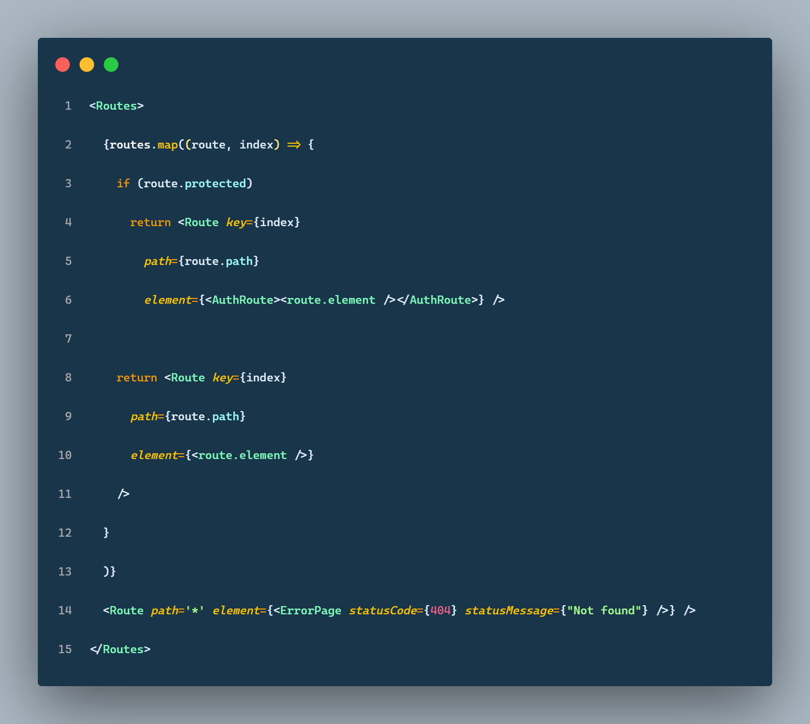
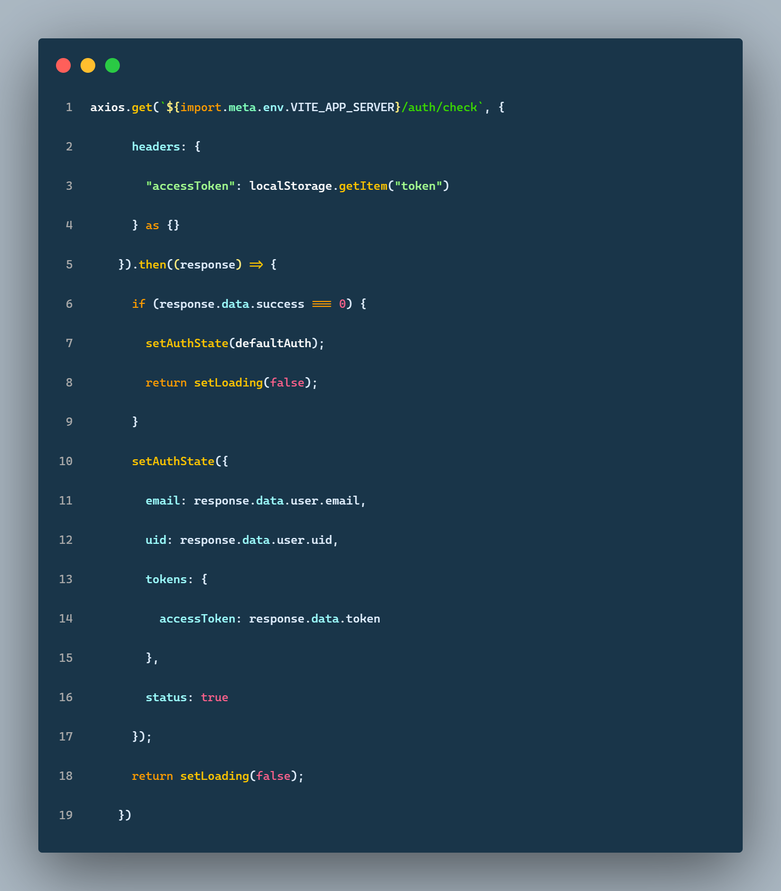
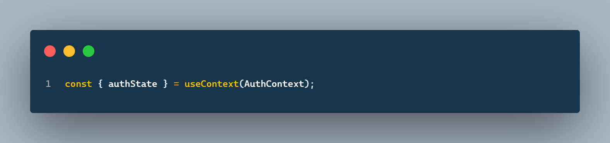

# NodeJS-Authentication
Frontend application with authentication via Express in combination with JWT.

## How it works
If you visit a route, it will determine if it is a protected route or not. If it is a protected route, it will be checking if the context state credentials match with the JWT on the backend. Whether the credentials and the JWT are legitimate, you'll see the page; otherwise, you will be sent to the login page.

If the routes are in the `route.ts` file, the project will automatically generate them. 

The authentication context's initial state is empty. When you log in or reload the page, the state will be changed to the `logged in` credentials, and the `JWT` will be added to the `localStorge`. If you update the `localStorage` token in something else, you will be redirected to the login page.

All information stored in the authentication context can be retrieved per page. You can access all user data and update the state within the application rather than through the console or storage. 

## Working example

